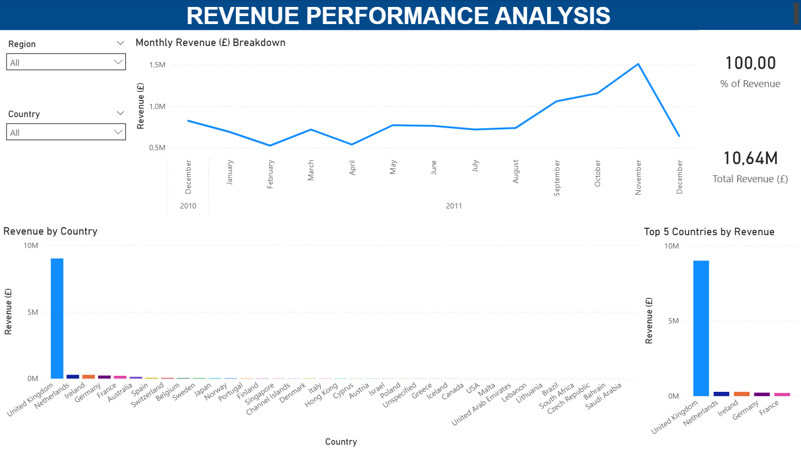
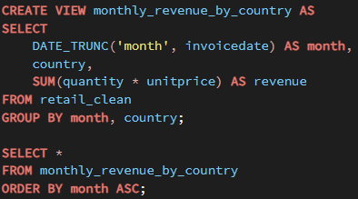
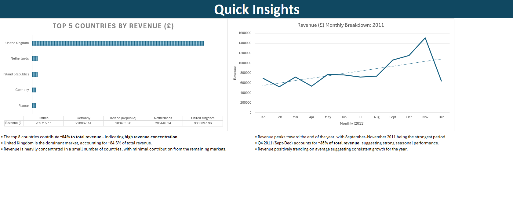
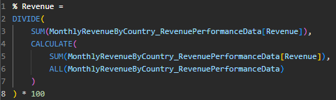
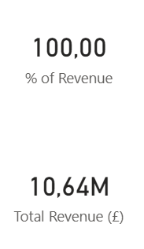
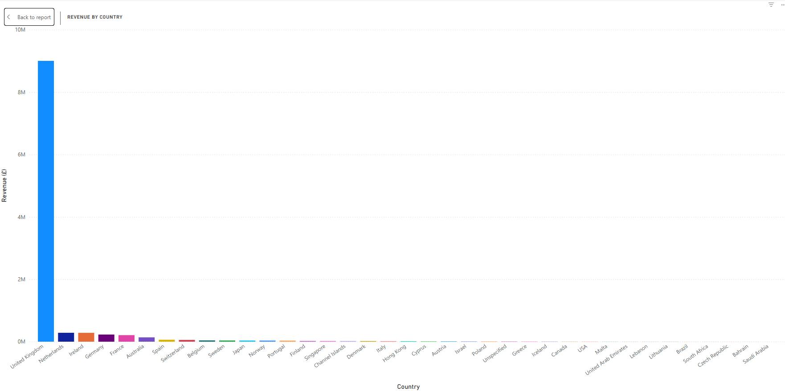
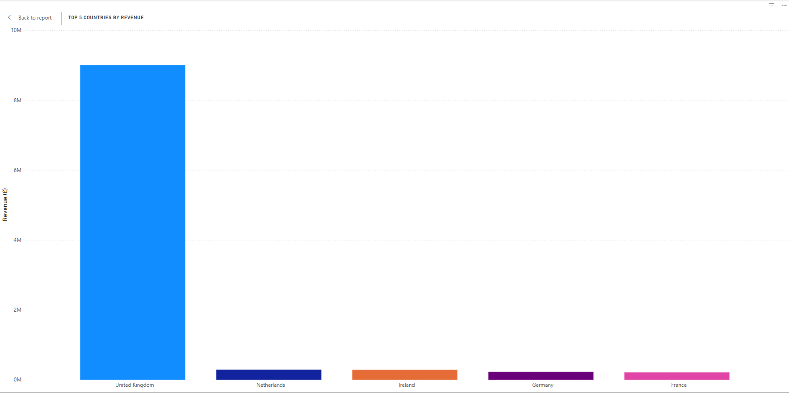
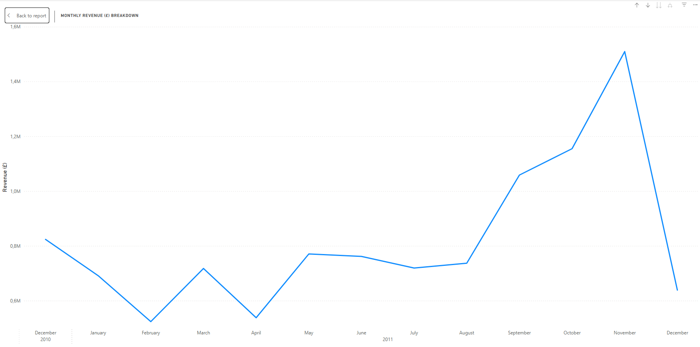
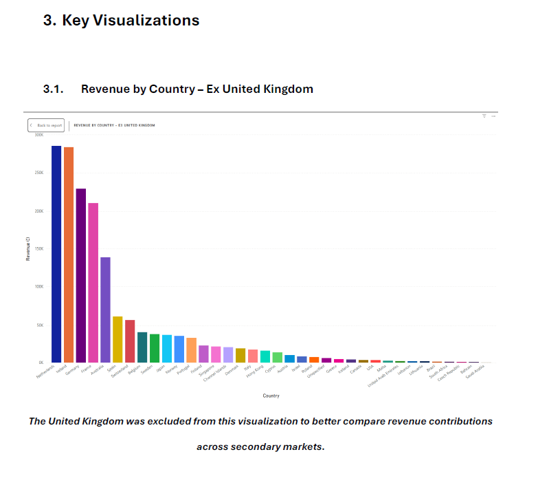

# Revenue-Performance-Analysis

## Overview

This project analyzes revenue performance across countries, regions, and time periods using SQL, Excel, Power BI, and business reporting techniques.

The objective was to identify:

- Key revenue-generating markets
- Revenue concentration risks
- Seasonal sales trends
- Country and regional performance patterns
- Business opportunities for growth and optimization

The project follows a full analytics workflow from raw database extraction through to dashboarding and executive reporting.

## Tools & Technologies

- PostgreSQL
- pgAdmin
- SQL
- Ms Excel
- Power BI
- Power Query
- DAX
- PDF Reporting

PLEASE NOTE: 
Initially attempted to categorize products based on stock code but the dataset (from Kaggle) did not provide stock codes consistent enough for accurate categorization.

---

## Project Workflow

### 1. SQL Data Extraction

The original dataset contained 541 909 retail transaction records stored in PostgreSQL. 
To focus specifically on revenue analysis, I created a retail_clean table (over 531 000 records), then created a SQL view to aggregate:

- Revenue by country
- Revenue by month

### SQL View Used

### Outcome
- Reduced dataset from 531 285 rows → 302 analytical records
- Time period analyzed: 01/12/2010 - 01/12/2011

---

### 2. Excel Data Cleaning & Preparation

After exporting the SQL output into Excel, I prepared the dataset for exploratory analysis and dashboarding.

#### Workbook Structure
- Raw Data
- Working Sheet
- Pivot Tables
- Key Values
- Quick Insights

#### Cleaning & Standardization

##### Data Preparation Tasks
- Converted exported table format into range format for easier manipulation
- Standardized column headers
- Updated revenue field naming
- Standardized country names
- Formatted dates using UK-style short date formatting
- Standardized revenue values to 2 decimal places
- verified overall dataset integrity

---

### 3. Exploratory Data Analysis (Excel)

### Pivot Tables Created

#### Revenue by Country
- Country
- Total Revenue (£)

#### Monthly Revenue Breakdown
- Month
- Total Revenue (£)

#### Business Questions Investigated
- Which month generated the highest revenue?
- Which country dominates overall revenue?
- What are the top 5 countries by revenue?
- Are there seasonal or quarterly trends?
- Is revenue concentrated in specific markets?

#### Key Insights Identified
- Top 5 countries contribute approximately 94%+ of total revenue
- United Kingdom contributes approximately 84% of total revenue
- Revenue is highly concentrated geographically
- Strong seasonal performance identified toward the end of the year
- Q4 2011 contributed approximately 35% of annual revenue
- Overall revenue trend showed positive growth across the year

---

### 4. Power BI Dashboard Development

The cleaned dataset was imported into Power BI for interactive dashboard creation.

#### Power Query Transformations
- Replicated Excel cleaning processes using Power Query
- Standardised fields and formatting
- Prepared data model for dashboarding

#### Data Modelling
- Create a custom country-to-region mapping table (Excel)
- Established relationships between main revenue dataset & region mapping dataset

#### DAX Measure
Created custom measure for percentage of total revenue

A custom DAX measure was specifically required to correctly calculate revenue percentages when filtering by region and country.

#### Dashboard Features

- Interactive Slicers : Region | Country

#### KPI Cards

- Total Revenue (£)
- % of Total Revenue

#### Visualizations

##### Revenue by Country

- Stacked column chart
- Dynamic regional filtering

##### Top 5 Countries by Revenue

- Top N filtered Stacked column chart
- Static benchmark comparison

##### Monthly Revenue Breakdown

- Interactive line chart
- Displays monthly revenue trends across the reporting period

---

## 5. PDF Business Report

A structured business report was created summarizing:
- Revenue concentration
- Country performance
- Seasonal trends
- Business risks
- Strategic recommendations

### Key Recommendations

#### Reduced Market Dependency Risk
- Expand into underperforming markets
- Reduce reliance on UK revenue

#### Capitalize on Seasonal Performance
- Increase marketing spend ahead of Q4
- Improve stock planning before peak demand periods

#### Strengthen Core Markets
- Focus on customer retention
- Introduce loyalty initiatives
- Implement targeted promotional strategies

### Key Findings

- Dominant Market : United Kingdom
- UK Revenue Contribution : ~84.58%
- Top 5 Revenue Contribution : ~97.74%
- Strongest Performance Period : Q4 2011
- Revenue Trend : Positive Growth

---

## Skills Demonstrated

- SQL Querying & Aggregation
- PostgreSQL & pgAdmin
- Data Cleaning & Standardisation
- Excel Pivot Tables & Analysis
- Exploratory Data Analysis (EDA)
- Power BI Dashboarding
- Power Query Transformations
- DAX Measures
- Data Modelling
- Business Reporting
- Data Storytelling

---

## Final Conclusion

This project demonstrates an end-to-end analytics workflow combining SQL, Excel, Power BI, and business reporting.

The analysis identified:
- Strong geographic revenue concentration
- Heavy reliance on the UK market
- Clear seasonal revenue spikes
- Opportunities for diversification and growth optimization

The project also demonstrates practical skills in:
- Data extraction
- Cleaning and transformation
- Dashboard development
- Business insight generation
- Executive-level reporting
